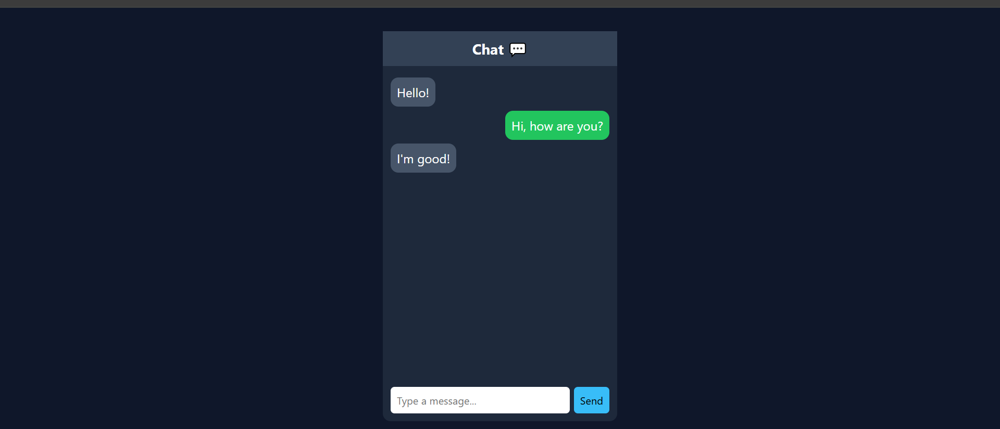

# 💬 Chat App UI - Day 1 Project 19

## 📌 Project Overview

This project is a modern **Chat Application UI** created as part of my semester challenge to build 200 websites.

It represents a messaging interface with chat bubbles, message alignment, and an input box.

---

## 🎯 Features

* 💬 Chat Interface Layout
* 🗨️ Left & Right Message Bubbles
* ⌨️ Input Box for Messages
* 📩 Send Button
* 🎨 Clean and Modern UI

---

## 🛠️ Technologies Used

* HTML5
* CSS3 (Flexbox)

---

## 📂 Project Structure

```id="x9k2m1"
site-19-chat-app/
│
├── index.html
├── style.css
├── preview.png
└── README.md
```

---

## 📸 Preview

> ⚠️ Make sure `preview.png` is uploaded in the same folder



---

## 💡 Learning Outcome

* Learned chat UI layout design
* Practiced Flexbox for alignment
* Built message bubble system
* Improved UI/UX understanding
* Strengthened Git & GitHub workflow

---

## 🔥 Author

**Yash Patil**
Future Data Engineer 🚀

---

## ⭐ Note

This project is part of my goal to build **200 websites** to improve my web development and design skills.
